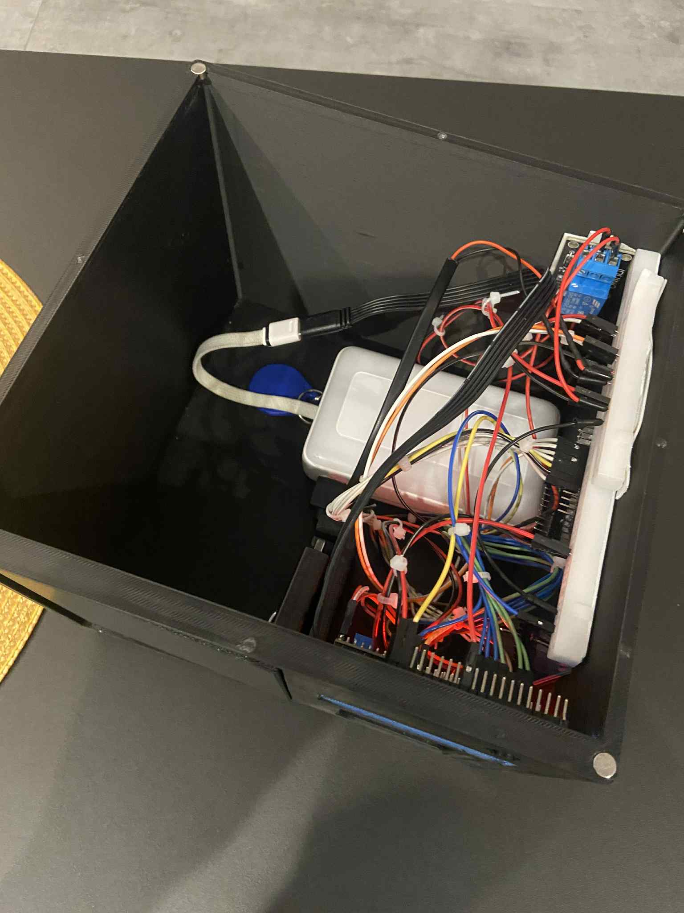
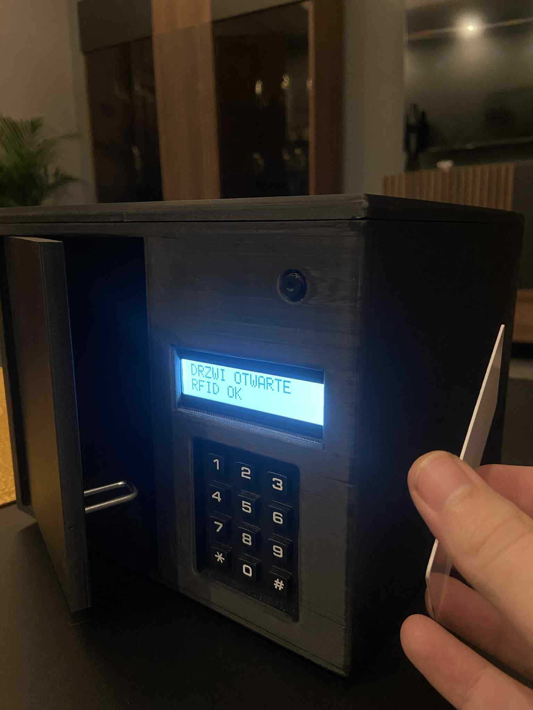
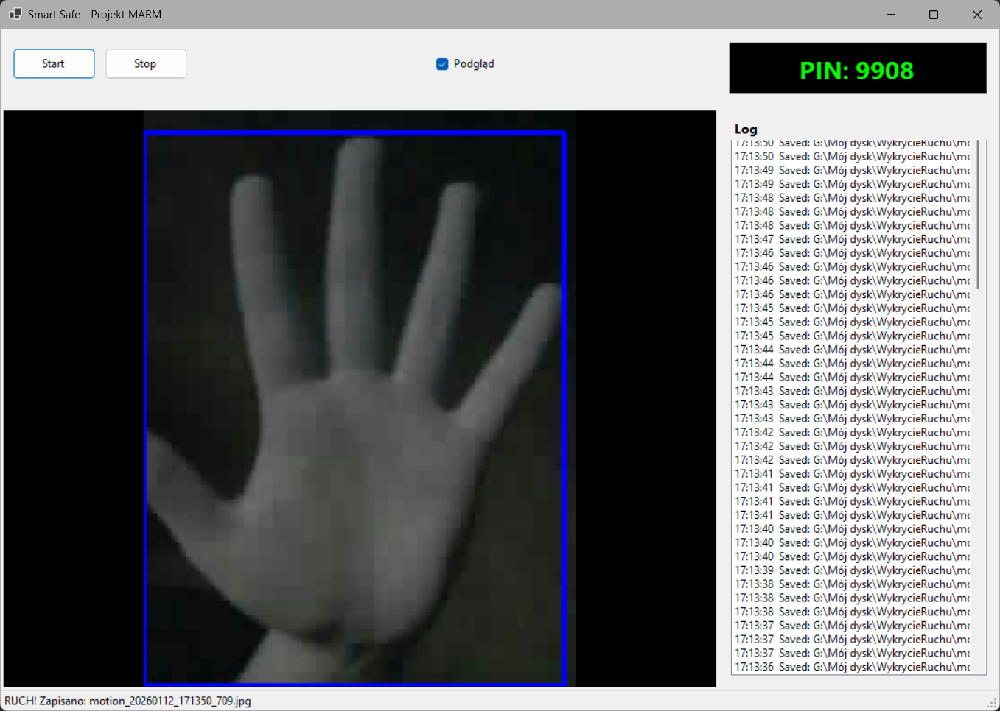

# Smart Safe - Projekt MARM

Projekt inteligentnego sejfu łączący mechaniczne zabezpieczenia z monitoringiem wizyjnym i zaawansowaną, zdalną weryfikacją tożsamości. System opiera się na mikrokontrolerach ESP8266 i ESP32 (architektura Dual-MCU) oraz dedykowanej aplikacji desktopowej (C# .NET) wykorzystującej analizę obrazu.

## Galeria

| Widok ogólny | Wnętrze |
| :-: | :-: |
|  |  |

| Interfejs - RFID | Aplikacja - Wykrycie Ruchu
| :-: | :-: |
|  |  |

## Główne Funkcjonalności

* **Architektura Dual-MCU:** System został podzielony na dwa mikrokontrolery z powodu ograniczeń sprzętowych modułu ESP32-CAM. Ponieważ większość pinów GPIO w tym module jest zajęta przez obsługę kamery i pamięci PSRAM, niemożliwe było podłączenie wszystkich peryferiów (klawiatury, RFID, LCD, serwa) do jednego układu. Dlatego obsługa RFID i rygla została wydzielona do osobnego układu ESP8266.
* **Komunikacja UDP:** Mikrokontrolery wymieniają między sobą statusy otwarcia (PIN_OK / RFID_OK) w sieci lokalnej, co łączy dwa niezależne moduły w jeden spójny system.
* **Monitoring wideo:** Strumieniowanie obrazu MJPEG z wnętrza sejfu lub otoczenia (zależnie od montażu kamery).
* **Detekcja ruchu:** Aplikacja PC analizuje obraz klatka po klatce przy użyciu algorytmów Computer Vision (OpenCV) i wykrywa zmiany, automatycznie zapisując zdjęcia na dysku po wykryciu aktywności.
* **Zdalna weryfikacja:** Stan systemu i podgląd są dostępne zdalnie przez aplikację.

## System Bezpieczeństwa: Dynamiczna Rotacja PIN (OTP)

Projekt wykorzystuje unikalny mechanizm autoryzacji zbliżony do tokenów bankowych, co eliminuje ryzyko poznania stałego hasła przez osoby niepowołane.

* **Wyłączny dostęp przez aplikację:** Aktualny kod PIN **nie jest stały** i zmienia się cyklicznie (rotacja haseł). Jest on widoczny **wyłącznie** w autoryzowanej aplikacji na komputerze PC. Użytkownik fizycznie znajdujący się przy sejfie nie może go otworzyć bez dostępu do komputera, ponieważ kod jest generowany losowo przez mikrokontroler i ukryty przed otoczeniem.
* **Technologia weryfikacji:** Aplikacja PC komunikuje się z ESP32 poprzez zabezpieczony endpoint HTTP (`/pin`). Odczyt aktualnego kodu wymaga przesłania w nagłówku zapytania specjalnego tokenu (`X-Auth`), co chroni przed nieautoryzowanym podglądem w sieci lokalnej.
* **Podwójna metoda wejścia:** Niezależnie od systemu PIN, sejf posiada czytnik RFID, umożliwiający otwarcie za pomocą zaprogramowanej karty zbliżeniowej (obsługiwane przez ESP8266).

## Lista Elementów (BOM)

Poniżej znajduje się zestawienie kluczowych komponentów wykorzystanych w projekcie.

| Element | Rola w systemie | Link (Przykładowy) |
| :--- | :--- | :--- |
| **ESP32-CAM** | Główna jednostka, serwer wideo, obsługa klawiatury, LCD i Zamka. | [[Link do sklepu](https://pl.aliexpress.com/item/1005008285512156.html?gatewayAdapt=glo2pol)] |
| **ESP (Dowolny)** | Obsługa czytnika RFID. | [[Link do sklepu](https://pl.aliexpress.com/item/1005006418608267.html?gatewayAdapt=glo2pol)] |
| **Czytnik RFID RC522** | Autoryzacja kartami zbliżeniowymi 13.56 MHz. | [[Link do sklepu](https://pl.aliexpress.com/item/1005006949661232.html?gatewayAdapt=glo2pol)] |
| **Klawiatura membranowa 3x4** | Interfejs wprowadzania kodu PIN. | [[Link do sklepu](https://pl.aliexpress.com/item/1005004948322546.html?gatewayAdapt=glo2pol)] |
| **Wyświetlacz LCD 2x16 (I2C)** | Wyświetlanie komunikatów systemowych. | [[Link do sklepu](https://pl.aliexpress.com/item/1005003785193247.html?gatewayAdapt=glo2pol)] |
| **Zamek** | Fizyczna blokada drzwi. | [[Link do sklepu](https://pl.aliexpress.com/item/1005004775883283.html?gatewayAdapt=glo2pol)] |
| **Moduł przekaźnika** | Do obsługi zamka. | [[Link do sklepu](https://botland.com.pl/przekazniki-przekazniki-arduino/8228-modul-przekaznika-iduino-1-kanal-styki-10a250vac-cewka-5v-5903351241229.html)] |
| **Magnesy 6x3 (x8 sztuk)** | Jako połączenie klapki z resztą sejfu | [[Link do sklepu](https://allegro.pl/produkt/magnes-neodymowy-walcowy-6x3-mm-hunter-n45-udzwig-0-90-kg-10-szt-df3e8ef4-5a3c-48db-953a-896c9a9c482a?offerId=7815010546)] |

## Projekt 3D (STL)

Obudowa sejfu została zaprojektowana w środowisku **SolidWorks**. Konstrukcja uwzględnia dedykowane mocowania dla elektroniki i spasowanie elementów ruchomych (drzwi, rygiel).

Pliki `.STL` gotowe do druku się w katalogu `/Stl's`:
* `Korpus.stl` - Główna bryła sejfu.
* `Drzwi.stl` - Drzwi.
* `Rurka.stl` - Jako oś obrotu drzwi.
* `Daszek.stl` - Pokrywa sejfu.

## Opis Oprogramowania

### 1. Moduł Zamka (ESP8266)
Plik: `ESP8266_RFID.ino`
Odpowiada za obsługę peryferiów, dla których zabrakło pinów w głównym module ESP32.
* Obsługuje czytnik RFID MFRC522 (weryfikacja UID karty).

### 2. Moduł Interfejsu i Kamery (ESP32)
Plik: `ESP32_LCD_KEYPAD_CAMERA_LOCK.ino`
Pełni rolę huba komunikacyjnego i interfejsu użytkownika.
* Uruchamia serwer **Camera Web Server** do streamingu wideo.
* Zarządza logiką zmiennego PINu i wystawia go przez API REST.
* Obsługuje klawiaturę membranową i wyświetlacz LCD.
* *Uwaga:* Kod odpowiedzialny za inicjalizację kamery i obsługę MJPEG bazuje na oficjalnych przykładach Espressif Systems, które zostały zmodyfikowane i zintegrowane z resztą systemu (obsługa Keypada, UDP i autorskiej logiki PIN).

### 3. Aplikacja Desktopowa (C# .NET)
Plik: `Program.cs` / Projekt Visual Studio
Centrum monitoringu napisane w technologii Windows Forms.
* **Stream Wideo:** Odbiera strumień MJPEG (`http://<IP>:81/stream`) i wyświetla go w oknie aplikacji.
* **Bezpieczeństwo:** Pobiera aktualny, rotujący PIN z zabezpieczonego endpointu (`http://<IP>:8080/pin`) używając tokenu autoryzacyjnego `X-Auth`.
* **Computer Vision:** Realizuje algorytm detekcji ruchu przy użyciu biblioteki **OpenCvSharp**. Porównuje klatki (`Absdiff`), proguje zmiany (`Threshold`) i analizuje kontury. Jeśli zmiana przekracza zdefiniowany próg, następuje automatyczny zapis zdjęcia dowodowego na dysk.

## Konfiguracja i Uruchomienie

1.  **Sieć WiFi:** W obu plikach `.ino` należy uzupełnić zmienne `ssid` oraz `pass`.
2.  **Adresacja IP:**
    * W kodzie ESP8266 ustaw adres docelowy ESP32 (`esp32_ip`).
    * W kodzie ESP32 ustaw adres docelowy ESP8266 (`esp8266_ip`).
    * Zalecane jest ustawienie stałych adresów IP (DHCP Reservation) w routerze.
3.  **Token Autoryzacyjny:** Upewnij się, że `AUTH_TOKEN` w kodzie ESP32 jest taki sam jak `AuthToken` w aplikacji C#.
4.  **Aplikacja PC:**
    * W pliku `Program.cs` zaktualizuj `StreamUrl` oraz `PinUrl`.
    * Skonfiguruj folder zapisu zdjęć w zmiennej `SaveDir`.
